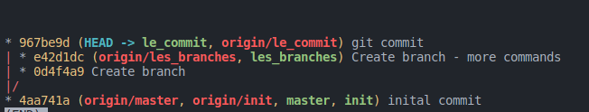
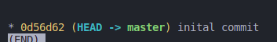

# Formation git CMAR

## Sommaire

1. Initialiser un dépôt git : `git init`
2. Le dossier `.git`
3. La configuration
4. La notion de distant/local
5. Qu'est-ce qu'un commit ?
6. Les branches et tags

## Initialiser un dépôt git

- Se placer dans un dossier contenant déjà du code ou non
- Exécuter la commande `git init`
- Un dossier `.git` est créé

## Le dossier `.git`

- Contient toutes les informations relatives à l'historique du projet
- Contient la configuration du projet

## La configuration

- La configuration est stockée dans le fichier `.git/config` (oar défaut)
- La configuration peut être globale (utilisateur) ou locale (projet).

Exemple : 

Consulter une configuration : 
- `git config user.email`

Ecrire dans la configuration locale
- `git config user.name "John"`

Ecrire dans la configuration globale
- `git config --global user.email "john.test@mail.com`

- `git config --global alias.hs "log --pretty=format:'%h %ad | %s%d [%an]' --graph --date=short --decorate --oneline --all"`

## La notion de distant/local

Le projet "repository" est stocké sur un environnement distant "remote", ainsi que sur tous les environnements locaux où il a été cloné. Chaque développeur a une copie du projet, et peut mettre à jour le remote, afin de diffuser ses modifications.

Tout ce qui est fait en local n'a aucun impact sur le remote tant que ce n'est pas poussé (commande `git push`). 

L'environnement local se met à jour lors de "pull" (commande `git pull` ou commande `git fetch`).

## Qu'est-ce qu'un commit ?

Un commit est un "snapshot" du projet, il contient tout le projet (ce n'est pas une différence par rapport au dernier commit). 

Chaque commit possède ue signature (hash) unique. Il est possible de cloner un projet en précisant le hash du commit.

## Les branches et tags

Une branche est utilisée pour organiser et identifier les commits, par exemple une branche de travail ou une branche de développement.

Une branche pointe vers un hash de commit.

Ici la version du code **master** peut être télchargéee soit avec un git clone de la branche **master** soit directement le hash de commit **0d56d62**